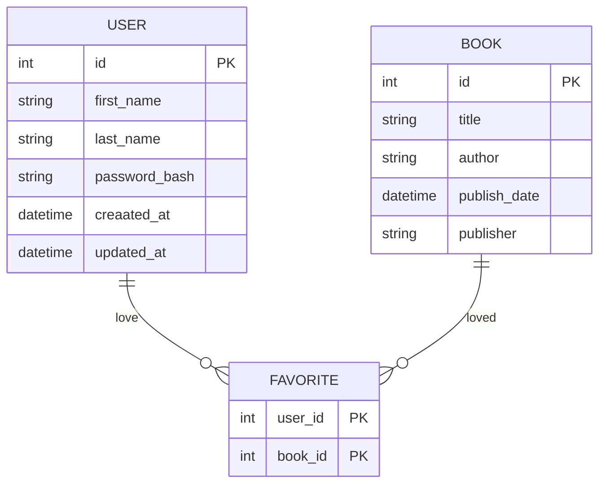

```mermaid
erDiagram
    USER {
        int id PK
        string first_name
        string last_name
        string password_bash
        datetime creaated_at
        datetime updated_at
    }
    BOOK {
        int id PK
        string title
        string author
        datetime publish_date
        string publisher
    }
    FAVORITE {
        int user_id PK
        int book_id PK
    }
    USER ||--o{ FAVORITE :love
    BOOK ||--o{ FAVORITE :loved
```
